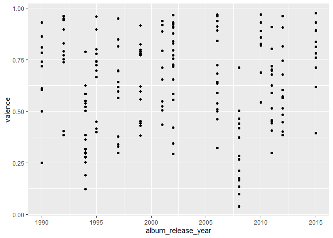
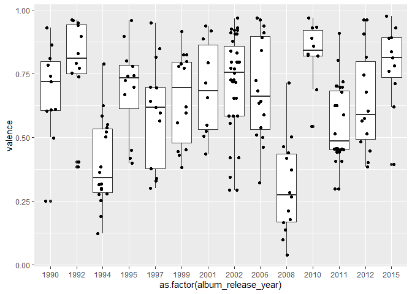
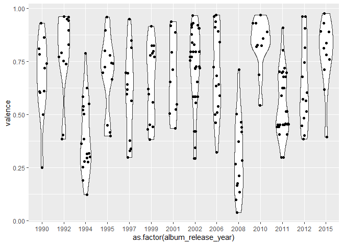
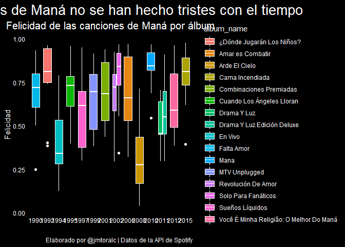
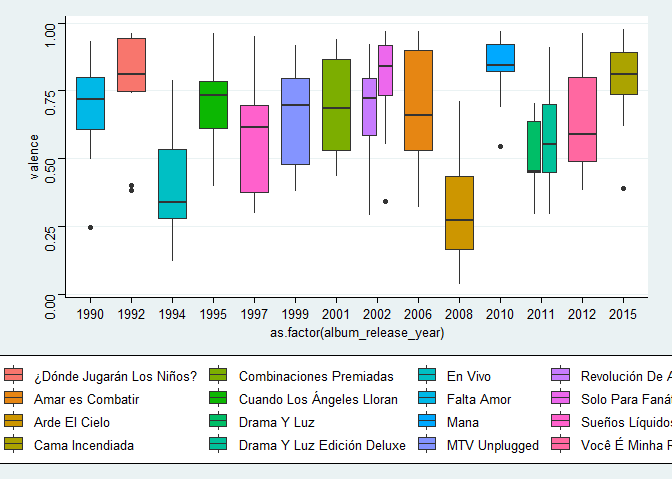
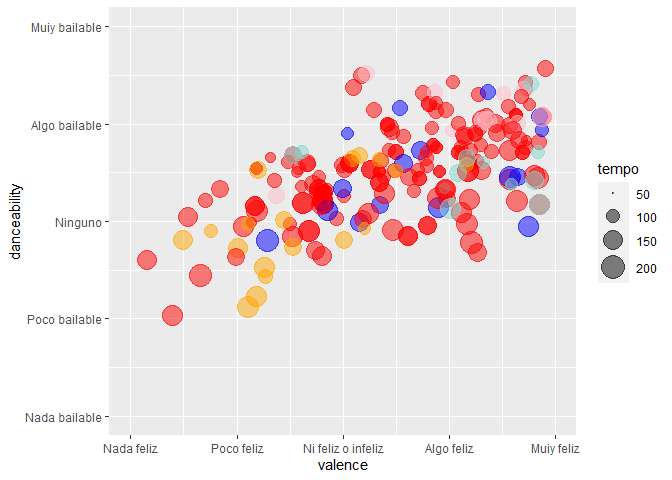
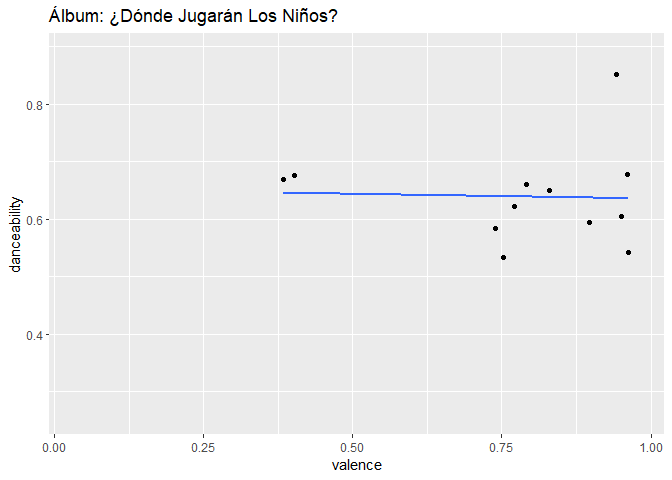
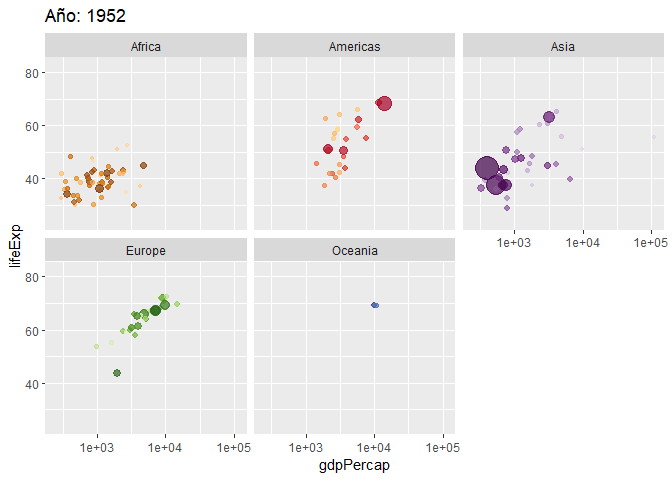
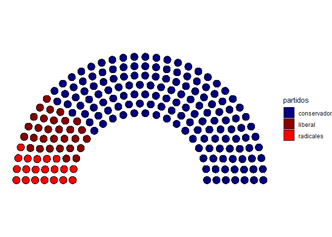
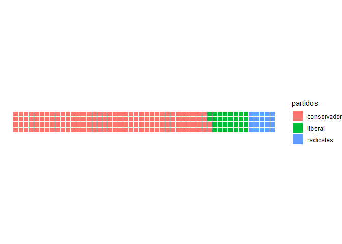

<style>
p.comment {
background-color: #DBDBDB;
padding: 10px;
border: 1px solid black;
margin-left: 25px;
border-radius: 5px;
font-style: italic;
}

.figure {
   margin-top: 20px;
   margin-bottom: 20px;
}

h1.title {
  font-weight: bold;
  font-family: Arial;  
}

h2.title {
  font-family: Arial;  
}

</style>


<style type="text/css">
#TOC {
  font-size: 13px;
  font-family: Arial;
}
</style>

\


## 1. Bibliotecas


```r
pacman::p_load(
  tidyverse, # Tidyverse y sus funciones
  gapminder, # Acceso a la base de datos de gapminder
  plotly, # Gráficas interactivas en javascript
  leaflet, # Mapas interactivos
  cowplot, # Ordenar, etiquetar
  ggthemes, # Temas cosméticos
  hrbrthemes, # Opción de temas elegantes
  gganimate, # Gráficas animadas
  ggforce, # Muchas geometrías y etiquetas
  ggridges, # Creación de ridges
  ggrepel, # Etiquetas que se repelan
  ggpol, # graficas de arco
  waffle, # Gráficas de wafles
  spotifyr # Spotifyr
)
```


Forma adicional de instalar spotifyR
 


```r
library(devtools)
devtools::install_github('charlie86/spotifyr')
library(spotifyr)
```


## 2. Datos


```r
Sys.setenv(SPOTIFY_CLIENT_ID = tu_id) #Usar id de spotify
Sys.setenv(SPOTIFY_CLIENT_SECRET = tu_id_secreta)

access_token <- get_spotify_access_token()

mana <- get_artist_audio_features("maná")
```

```
## Warning: `mutate_()` is deprecated as of dplyr 0.7.0.
## Please use `mutate()` instead.
## See vignette('programming') for more help
## This warning is displayed once every 8 hours.
## Call `lifecycle::last_warnings()` to see where this warning was generated.
```

```r
#mana <- read_csv("input/mana.csv")
```


## 3. Un breve repaso a ggplot2


```r
glimpse(mana)
```

```
## Rows: 218
## Columns: 39
## $ artist_name                  <chr> "Maná", "Maná", "Maná", "Maná", "Maná", "Maná", "M...
## $ artist_id                    <chr> "7okwEbXzyT2VffBmyQBWLz", "7okwEbXzyT2VffBmyQBWLz"...
## $ album_id                     <chr> "36lGlwe75fTsr4CLVlfYQa", "36lGlwe75fTsr4CLVlfYQa"...
## $ album_type                   <chr> "album", "album", "album", "album", "album", "albu...
## $ album_images                 <list> [<data.frame[3 x 3]>, <data.frame[3 x 3]>, <data....
## $ album_release_date           <chr> "2015-04-21", "2015-04-21", "2015-04-21", "2015-04...
## $ album_release_year           <dbl> 2015, 2015, 2015, 2015, 2015, 2015, 2015, 2015, 20...
## $ album_release_date_precision <chr> "day", "day", "day", "day", "day", "day", "day", "...
## $ danceability                 <dbl> 0.738, 0.771, 0.672, 0.625, 0.724, 0.857, 0.892, 0...
## $ energy                       <dbl> 0.855, 0.747, 0.960, 0.655, 0.861, 0.561, 0.814, 0...
## $ key                          <int> 4, 4, 5, 0, 4, 9, 11, 2, 8, 9, 2, 7, 4, 2, 9, 7, 2...
## $ loudness                     <dbl> -4.124, -4.426, -3.922, -7.118, -5.702, -7.288, -5...
## $ mode                         <int> 0, 0, 1, 1, 0, 1, 0, 0, 0, 1, 0, 1, 1, 1, 1, 1, 1,...
## $ speechiness                  <dbl> 0.0375, 0.0286, 0.0365, 0.0301, 0.0449, 0.0292, 0....
## $ acousticness                 <dbl> 0.01650, 0.10900, 0.03900, 0.46100, 0.02890, 0.435...
## $ instrumentalness             <dbl> 6.12e-06, 1.31e-06, 4.02e-04, 5.39e-05, 5.67e-03, ...
## $ liveness                     <dbl> 0.2450, 0.1430, 0.1580, 0.3650, 0.0536, 0.0831, 0....
## $ valence                      <dbl> 0.711, 0.838, 0.782, 0.393, 0.812, 0.760, 0.976, 0...
## $ tempo                        <dbl> 101.989, 107.032, 117.040, 87.951, 110.005, 99.989...
## $ track_id                     <chr> "7H4mYbLFCNqn37q6Yeylly", "33AeuOquHjWCNVEsHFAJzd"...
## $ analysis_url                 <chr> "https://api.spotify.com/v1/audio-analysis/7H4mYbL...
## $ time_signature               <int> 4, 4, 4, 4, 4, 4, 4, 4, 4, 4, 4, 4, 4, 4, 4, 4, 4,...
## $ artists                      <list> [<data.frame[1 x 6]>, <data.frame[1 x 6]>, <data....
## $ available_markets            <list> [<"AD", "AE", "AG", "AL", "AM", "AR", "AT", "AU",...
## $ disc_number                  <int> 1, 1, 1, 1, 1, 1, 1, 1, 1, 1, 1, 1, 1, 1, 1, 1, 1,...
## $ duration_ms                  <int> 244586, 276853, 258986, 316520, 225506, 272576, 30...
## $ explicit                     <lgl> FALSE, FALSE, FALSE, FALSE, FALSE, FALSE, FALSE, F...
## $ track_href                   <chr> "https://api.spotify.com/v1/tracks/7H4mYbLFCNqn37q...
## $ is_local                     <lgl> FALSE, FALSE, FALSE, FALSE, FALSE, FALSE, FALSE, F...
## $ track_name                   <chr> "Adicto A Tu Amor", "La Cama Incendiada", "La Pris...
## $ track_preview_url            <chr> "https://p.scdn.co/mp3-preview/cfb70b4b6abf504ff19...
## $ track_number                 <int> 1, 2, 3, 4, 5, 6, 7, 8, 9, 10, 11, 1, 2, 3, 4, 5, ...
## $ type                         <chr> "track", "track", "track", "track", "track", "trac...
## $ track_uri                    <chr> "spotify:track:7H4mYbLFCNqn37q6Yeylly", "spotify:t...
## $ external_urls.spotify        <chr> "https://open.spotify.com/track/7H4mYbLFCNqn37q6Ye...
## $ album_name                   <chr> "Cama Incendiada", "Cama Incendiada", "Cama Incend...
## $ key_name                     <chr> "E", "E", "F", "C", "E", "A", "B", "D", "G#", "A",...
## $ mode_name                    <chr> "minor", "minor", "major", "major", "minor", "majo...
## $ key_mode                     <chr> "E minor", "E minor", "F major", "C major", "E min...
```

```r
ggplot(
  data = mana,
  aes(
    x = album_release_year,
    y = valence
  )
) + # Los elementos gráficos se unen con un signo de +
  geom_point()
```

<!-- -->

```r
ggplot(
  data = mana,
  aes(
    x = as.factor(album_release_year),
    y = valence
  )
) + # Los elementos gráficos se unen con un signo de +
  geom_boxplot() +
  geom_jitter(width = 0.2)
```

<!-- -->

```r
ggplot(
  data = mana,
  aes(
    x = as.factor(album_release_year),
    y = valence
  )
) + # Los elementos gráficos se unen con un signo de +
  geom_violin() +
  geom_sina()
```

<!-- -->


## 4. Temas y paletas


```r
caja <- ggplot(
  data = mana,
  aes(
    x = as.factor(album_release_year),
    y = valence,
    fill = album_name
  )
) + # Los elementos gráficos se unen con un signo de +
  geom_boxplot() 

ggplotly(caja)
```

<!--html_preserve--><div id="htmlwidget-d1dc079ea28e02777c30" style="width:672px;height:480px;" class="plotly html-widget"></div>
<script type="application/json" data-for="htmlwidget-d1dc079ea28e02777c30">{"x":{"data":[{"x":[2,2,2,2,2,2,2,2,2,2,2,2],"y":[0.897,0.962,0.95,0.384,0.739,0.771,0.96,0.83,0.942,0.792,0.403,0.753],"hoverinfo":"y","type":"box","fillcolor":"rgba(248,118,109,1)","marker":{"opacity":null,"outliercolor":"rgba(0,0,0,1)","line":{"width":1.88976377952756,"color":"rgba(0,0,0,1)"},"size":5.66929133858268},"line":{"color":"rgba(51,51,51,1)","width":1.88976377952756},"name":"¿Dónde Jugarán Los Niños?","legendgroup":"¿Dónde Jugarán Los Niños?","showlegend":true,"xaxis":"x","yaxis":"y","frame":null},{"x":[9,9,9,9,9,9,9,9,9,9,9,9,9,9,9,9],"y":[0.321,0.462,0.724,0.538,0.641,0.682,0.635,0.588,0.499,0.937,0.962,0.97,0.912,0.893,0.843,0.509],"hoverinfo":"y","type":"box","fillcolor":"rgba(230,134,19,1)","marker":{"opacity":null,"outliercolor":"rgba(0,0,0,1)","line":{"width":1.88976377952756,"color":"rgba(0,0,0,1)"},"size":5.66929133858268},"line":{"color":"rgba(51,51,51,1)","width":1.88976377952756},"name":"Amar es Combatir","legendgroup":"Amar es Combatir","showlegend":true,"xaxis":"x","yaxis":"y","frame":null},{"x":[10,10,10,10,10,10,10,10,10,10,10,10,10,10],"y":[0.439,0.165,0.266,0.419,0.211,0.135,0.713,0.0986,0.0391,0.503,0.283,0.176,0.372,0.463],"hoverinfo":"y","type":"box","fillcolor":"rgba(205,150,0,1)","marker":{"opacity":null,"outliercolor":"rgba(0,0,0,1)","line":{"width":1.88976377952756,"color":"rgba(0,0,0,1)"},"size":5.66929133858268},"line":{"color":"rgba(51,51,51,1)","width":1.88976377952756},"name":"Arde El Cielo","legendgroup":"Arde El Cielo","showlegend":true,"xaxis":"x","yaxis":"y","frame":null},{"x":[14,14,14,14,14,14,14,14,14,14,14],"y":[0.711,0.838,0.782,0.393,0.812,0.76,0.976,0.891,0.619,0.93,0.892],"hoverinfo":"y","type":"box","fillcolor":"rgba(171,163,0,1)","marker":{"opacity":null,"outliercolor":"rgba(0,0,0,1)","line":{"width":1.88976377952756,"color":"rgba(0,0,0,1)"},"size":5.66929133858268},"line":{"color":"rgba(51,51,51,1)","width":1.88976377952756},"name":"Cama Incendiada","legendgroup":"Cama Incendiada","showlegend":true,"xaxis":"x","yaxis":"y","frame":null},{"x":[7,7,7,7,7,7,7,7,7,7],"y":[0.713,0.888,0.525,0.919,0.938,0.548,0.434,0.655,0.793,0.504],"hoverinfo":"y","type":"box","fillcolor":"rgba(124,174,0,1)","marker":{"opacity":null,"outliercolor":"rgba(0,0,0,1)","line":{"width":1.88976377952756,"color":"rgba(0,0,0,1)"},"size":5.66929133858268},"line":{"color":"rgba(51,51,51,1)","width":1.88976377952756},"name":"Combinaciones Premiadas","legendgroup":"Combinaciones Premiadas","showlegend":true,"xaxis":"x","yaxis":"y","frame":null},{"x":[4,4,4,4,4,4,4,4,4,4,4,4],"y":[0.779,0.8,0.417,0.898,0.398,0.697,0.667,0.724,0.743,0.449,0.741,0.96],"hoverinfo":"y","type":"box","fillcolor":"rgba(12,183,2,1)","marker":{"opacity":null,"outliercolor":"rgba(0,0,0,1)","line":{"width":1.88976377952756,"color":"rgba(0,0,0,1)"},"size":5.66929133858268},"line":{"color":"rgba(51,51,51,1)","width":1.88976377952756},"name":"Cuando Los Ángeles Lloran","legendgroup":"Cuando Los Ángeles Lloran","showlegend":true,"xaxis":"x","yaxis":"y","frame":null},{"x":[12,12,12,12,12,12,12,12,12,12,12,12],"y":[0.625,0.514,0.679,0.455,0.443,0.297,0.452,0.452,0.456,0.407,0.698,0.703],"hoverinfo":"y","type":"box","fillcolor":"rgba(0,190,103,1)","marker":{"opacity":null,"outliercolor":"rgba(0,0,0,1)","line":{"width":1.88976377952756,"color":"rgba(0,0,0,1)"},"size":5.66929133858268},"line":{"color":"rgba(51,51,51,1)","width":1.88976377952756},"name":"Drama Y Luz","legendgroup":"Drama Y Luz","showlegend":true,"xaxis":"x","yaxis":"y","frame":null},{"x":[12,12,12,12,12,12,12,12,12,12,12,12,12,12,12,12],"y":[0.625,0.514,0.679,0.455,0.443,0.297,0.452,0.452,0.456,0.407,0.698,0.703,0.91,0.803,0.589,0.719],"hoverinfo":"y","type":"box","fillcolor":"rgba(0,193,154,1)","marker":{"opacity":null,"outliercolor":"rgba(0,0,0,1)","line":{"width":1.88976377952756,"color":"rgba(0,0,0,1)"},"size":5.66929133858268},"line":{"color":"rgba(51,51,51,1)","width":1.88976377952756},"name":"Drama Y Luz Edición Deluxe","legendgroup":"Drama Y Luz Edición Deluxe","showlegend":true,"xaxis":"x","yaxis":"y","frame":null},{"x":[3,3,3,3,3,3,3,3,3,3,3,3,3,3,3,3,3,3],"y":[0.55,0.295,0.362,0.253,0.123,0.189,0.538,0.521,0.585,0.626,0.789,0.278,0.502,0.315,0.318,0.276,0.384,0.3],"hoverinfo":"y","type":"box","fillcolor":"rgba(0,191,196,1)","marker":{"opacity":null,"outliercolor":"rgba(0,0,0,1)","line":{"width":1.88976377952756,"color":"rgba(0,0,0,1)"},"size":5.66929133858268},"line":{"color":"rgba(51,51,51,1)","width":1.88976377952756},"name":"En Vivo","legendgroup":"En Vivo","showlegend":true,"xaxis":"x","yaxis":"y","frame":null},{"x":[1,1,1,1,1,1,1,1,1,1,1],"y":[0.609,0.785,0.499,0.72,0.61,0.863,0.811,0.604,0.249,0.932,0.74],"hoverinfo":"y","type":"box","fillcolor":"rgba(0,184,231,1)","marker":{"opacity":null,"outliercolor":"rgba(0,0,0,1)","line":{"width":1.88976377952756,"color":"rgba(0,0,0,1)"},"size":5.66929133858268},"line":{"color":"rgba(51,51,51,1)","width":1.88976377952756},"name":"Falta Amor","legendgroup":"Falta Amor","showlegend":true,"xaxis":"x","yaxis":"y","frame":null},{"x":[11,11,11,11,11,11,11,11,11,11],"y":[0.824,0.827,0.544,0.969,0.891,0.688,0.932,0.819,0.858,0.93],"hoverinfo":"y","type":"box","fillcolor":"rgba(0,169,255,1)","marker":{"opacity":null,"outliercolor":"rgba(0,0,0,1)","line":{"width":1.88976377952756,"color":"rgba(0,0,0,1)"},"size":5.66929133858268},"line":{"color":"rgba(51,51,51,1)","width":1.88976377952756},"name":"Mana","legendgroup":"Mana","showlegend":true,"xaxis":"x","yaxis":"y","frame":null},{"x":[6,6,6,6,6,6,6,6,6,6,6,6,6,6],"y":[0.381,0.597,0.43,0.559,0.825,0.443,0.788,0.916,0.452,0.62,0.772,0.826,0.779,0.798],"hoverinfo":"y","type":"box","fillcolor":"rgba(132,148,255,1)","marker":{"opacity":null,"outliercolor":"rgba(0,0,0,1)","line":{"width":1.88976377952756,"color":"rgba(0,0,0,1)"},"size":5.66929133858268},"line":{"color":"rgba(51,51,51,1)","width":1.88976377952756},"name":"MTV Unplugged","legendgroup":"MTV Unplugged","showlegend":true,"xaxis":"x","yaxis":"y","frame":null},{"x":[8,8,8,8,8,8,8,8,8,8,8,8,8,8,8,8,8,8,8,8,8,8,8,8],"y":[0.922,0.719,0.585,0.795,0.585,0.293,0.907,0.42,0.726,0.771,0.796,0.654,0.922,0.719,0.585,0.795,0.585,0.293,0.907,0.42,0.726,0.771,0.796,0.654],"hoverinfo":"y","type":"box","fillcolor":"rgba(199,124,255,1)","marker":{"opacity":null,"outliercolor":"rgba(0,0,0,1)","line":{"width":1.88976377952756,"color":"rgba(0,0,0,1)"},"size":5.66929133858268},"line":{"color":"rgba(51,51,51,1)","width":1.88976377952756},"name":"Revolución De Amor","legendgroup":"Revolución De Amor","showlegend":true,"xaxis":"x","yaxis":"y","frame":null},{"x":[8,8,8,8,8,8,8,8,8,8,8],"y":[0.555,0.911,0.754,0.84,0.716,0.968,0.877,0.831,0.931,0.925,0.344],"hoverinfo":"y","type":"box","fillcolor":"rgba(237,104,237,1)","marker":{"opacity":null,"outliercolor":"rgba(0,0,0,1)","line":{"width":1.88976377952756,"color":"rgba(0,0,0,1)"},"size":5.66929133858268},"line":{"color":"rgba(51,51,51,1)","width":1.88976377952756},"name":"Solo Para Fanáticos","legendgroup":"Solo Para Fanáticos","showlegend":true,"xaxis":"x","yaxis":"y","frame":null},{"x":[5,5,5,5,5,5,5,5,5,5,5,5,5],"y":[0.696,0.643,0.299,0.596,0.85,0.564,0.339,0.698,0.328,0.617,0.951,0.815,0.377],"hoverinfo":"y","type":"box","fillcolor":"rgba(255,97,204,1)","marker":{"opacity":null,"outliercolor":"rgba(0,0,0,1)","line":{"width":1.88976377952756,"color":"rgba(0,0,0,1)"},"size":5.66929133858268},"line":{"color":"rgba(51,51,51,1)","width":1.88976377952756},"name":"Sueños Líquidos","legendgroup":"Sueños Líquidos","showlegend":true,"xaxis":"x","yaxis":"y","frame":null},{"x":[13,13,13,13,13,13,13,13,13,13,13,13,13,13],"y":[0.384,0.402,0.816,0.604,0.573,0.677,0.962,0.746,0.907,0.447,0.514,0.484,0.962,0.564],"hoverinfo":"y","type":"box","fillcolor":"rgba(255,104,161,1)","marker":{"opacity":null,"outliercolor":"rgba(0,0,0,1)","line":{"width":1.88976377952756,"color":"rgba(0,0,0,1)"},"size":5.66929133858268},"line":{"color":"rgba(51,51,51,1)","width":1.88976377952756},"name":"Você É Minha Religião: O Melhor Do Maná","legendgroup":"Você É Minha Religião: O Melhor Do Maná","showlegend":true,"xaxis":"x","yaxis":"y","frame":null}],"layout":{"margin":{"t":26.2283105022831,"r":7.30593607305936,"b":40.1826484018265,"l":48.9497716894977},"plot_bgcolor":"rgba(235,235,235,1)","paper_bgcolor":"rgba(255,255,255,1)","font":{"color":"rgba(0,0,0,1)","family":"","size":14.6118721461187},"xaxis":{"domain":[0,1],"automargin":true,"type":"linear","autorange":false,"range":[0.4,14.6],"tickmode":"array","ticktext":["1990","1992","1994","1995","1997","1999","2001","2002","2006","2008","2010","2011","2012","2015"],"tickvals":[1,2,3,4,5,6,7,8,9,10,11,12,13,14],"categoryorder":"array","categoryarray":["1990","1992","1994","1995","1997","1999","2001","2002","2006","2008","2010","2011","2012","2015"],"nticks":null,"ticks":"outside","tickcolor":"rgba(51,51,51,1)","ticklen":3.65296803652968,"tickwidth":0.66417600664176,"showticklabels":true,"tickfont":{"color":"rgba(77,77,77,1)","family":"","size":11.689497716895},"tickangle":-0,"showline":false,"linecolor":null,"linewidth":0,"showgrid":true,"gridcolor":"rgba(255,255,255,1)","gridwidth":0.66417600664176,"zeroline":false,"anchor":"y","title":{"text":"as.factor(album_release_year)","font":{"color":"rgba(0,0,0,1)","family":"","size":14.6118721461187}},"hoverformat":".2f"},"yaxis":{"domain":[0,1],"automargin":true,"type":"linear","autorange":false,"range":[-0.00774499999999999,1.022845],"tickmode":"array","ticktext":["0.00","0.25","0.50","0.75","1.00"],"tickvals":[-8.67361737988404e-19,0.25,0.5,0.75,1],"categoryorder":"array","categoryarray":["0.00","0.25","0.50","0.75","1.00"],"nticks":null,"ticks":"outside","tickcolor":"rgba(51,51,51,1)","ticklen":3.65296803652968,"tickwidth":0.66417600664176,"showticklabels":true,"tickfont":{"color":"rgba(77,77,77,1)","family":"","size":11.689497716895},"tickangle":-0,"showline":false,"linecolor":null,"linewidth":0,"showgrid":true,"gridcolor":"rgba(255,255,255,1)","gridwidth":0.66417600664176,"zeroline":false,"anchor":"x","title":{"text":"valence","font":{"color":"rgba(0,0,0,1)","family":"","size":14.6118721461187}},"hoverformat":".2f"},"shapes":[{"type":"rect","fillcolor":null,"line":{"color":null,"width":0,"linetype":[]},"yref":"paper","xref":"paper","x0":0,"x1":1,"y0":0,"y1":1}],"showlegend":true,"legend":{"bgcolor":"rgba(255,255,255,1)","bordercolor":"transparent","borderwidth":1.88976377952756,"font":{"color":"rgba(0,0,0,1)","family":"","size":11.689497716895},"y":0.93503937007874},"annotations":[{"text":"album_name","x":1.02,"y":1,"showarrow":false,"ax":0,"ay":0,"font":{"color":"rgba(0,0,0,1)","family":"","size":14.6118721461187},"xref":"paper","yref":"paper","textangle":-0,"xanchor":"left","yanchor":"bottom","legendTitle":true}],"hovermode":"closest","barmode":"relative"},"config":{"doubleClick":"reset","showSendToCloud":false},"source":"A","attrs":{"29cca5f1f16":{"x":{},"y":{},"fill":{},"type":"box"}},"cur_data":"29cca5f1f16","visdat":{"29cca5f1f16":["function (y) ","x"]},"highlight":{"on":"plotly_click","persistent":false,"dynamic":false,"selectize":false,"opacityDim":0.2,"selected":{"opacity":1},"debounce":0},"shinyEvents":["plotly_hover","plotly_click","plotly_selected","plotly_relayout","plotly_brushed","plotly_brushing","plotly_clickannotation","plotly_doubleclick","plotly_deselect","plotly_afterplot","plotly_sunburstclick"],"base_url":"https://plot.ly"},"evals":[],"jsHooks":[]}</script><!--/html_preserve-->

```r
caja_dark <- ggplot(
  data = mana,
  aes(
    x = as.factor(album_release_year),
    y = valence,
    fill = album_name
  )
) +
  geom_boxplot(color="white") +
  labs(title ="Las canciones de Maná no se han hecho tristes con el tiempo",
       subtitle = "Felicidad de las canciones de Maná por álbum",
       x ="", 
       y = "Felicidad",
       caption = "Elaborado por @jmtoralc | Datos de la API de Spotify") +
  theme_minimal() +
  theme(
    plot.title = element_text(hjust = 0.5, size= 20, color="white"),
    plot.subtitle = element_text(hjust = 0.5, size= 15, color ="white"),
    plot.background = element_rect(fill="black"),
    panel.background = element_rect(fill="black"),
    panel.grid = element_blank(),
    text = element_text(colour="white"),
    axis.text = element_text(colour="white")
  )

#ggsave("outputs/caja1.svg")

caja_dark
```

<!-- -->

```r
caja +
  theme_stata()
```

<!-- -->


Usar una interfaz gráfica.


```r
library(esquisse)

esquisse::esquisser()
```


`


## 5. Escalas

Propongamos una ecuación:

$$dance = valence x + u $$


```r
ggplot(
  data = mana,
  aes(
    x = valence,
    y = danceability,
    size = tempo                        
  )
) +
  geom_point(aes(color=album_name), alpha=0.5) +
  #geom_smooth(method = "lm", se=F) +
  guides(color = F) +
  #geom_mark_rect(aes(color=album_name)) 
  scale_color_manual(values = c("#81d8d0","blue","red","red","red",
                                "red","red","red","orange","red","red",
                                "red","red","pink","red", "red")) +
  #scale_color_brewer(palette="Blues")
  scale_x_continuous(limits=c(0,1),
                     breaks = c(0,0.25,0.5,0.75, 1),
                     labels = c("Nada feliz", 
                                "Poco feliz", 
                                "Ni feliz o infeliz", 
                                "Algo feliz", 
                                "Muiy feliz")) +
  scale_y_continuous(limits=c(0,1),
                     breaks = c(0,0.25,0.5,0.75, 1),
                     labels = c("Nada bailable", 
                                "Poco bailable", 
                                "Ninguno", 
                                "Algo bailable", 
                                "Muiy bailable")) +
  scale_size(range = c(0,8),
             breaks = c(50, 100, 150, 200),
             limits = c(50,200))
```

<!-- -->


 
## 6. Animación


```r
#install.packages("transformr")

ggplot(
  data = mana,
  aes(
    x = valence,
    y = danceability
  )
) +
  geom_point() +
  geom_smooth(se=F, method = "lm") +
  guides(fill=F) +
  transition_states(
    album_name,
    transition_length = 2,
    state_length = 3
  ) +
  enter_fade() +
  exit_shrink() +
  ease_aes("sine-in-out") +
  labs(title = "Álbum: {closest_state}")
```

```
## `geom_smooth()` using formula 'y ~ x'
```

```
## 
Rendering [>---------------------------------------------------------] at 9 fps ~ eta: 11s
Rendering [=>------------------------------------------------------] at 4.2 fps ~ eta: 23s
Rendering [=>--------------------------------------------------------] at 5 fps ~ eta: 19s
Rendering [==>-----------------------------------------------------] at 5.7 fps ~ eta: 17s
Rendering [==>-----------------------------------------------------] at 6.2 fps ~ eta: 15s
Rendering [===>----------------------------------------------------] at 6.4 fps ~ eta: 14s
Rendering [===>----------------------------------------------------] at 6.7 fps ~ eta: 14s
Rendering [====>---------------------------------------------------] at 7.1 fps ~ eta: 13s
Rendering [=====>--------------------------------------------------] at 7.4 fps ~ eta: 12s
Rendering [=====>--------------------------------------------------] at 7.8 fps ~ eta: 11s
Rendering [======>-------------------------------------------------] at 8.1 fps ~ eta: 11s
Rendering [======>-------------------------------------------------] at 8.3 fps ~ eta: 10s
Rendering [=======>------------------------------------------------] at 8.5 fps ~ eta: 10s
Rendering [========>-----------------------------------------------] at 8.7 fps ~ eta: 10s
Rendering [=========>----------------------------------------------] at 8.9 fps ~ eta:  9s
Rendering [=========>------------------------------------------------] at 9 fps ~ eta:  9s
Rendering [==========>---------------------------------------------] at 9.2 fps ~ eta:  9s
Rendering [==========>---------------------------------------------] at 9.3 fps ~ eta:  9s
Rendering [===========>--------------------------------------------] at 9.4 fps ~ eta:  8s
Rendering [===========>--------------------------------------------] at 9.5 fps ~ eta:  8s
Rendering [============>-------------------------------------------] at 9.5 fps ~ eta:  8s
Rendering [============>-------------------------------------------] at 9.6 fps ~ eta:  8s
Rendering [=============>------------------------------------------] at 9.6 fps ~ eta:  8s
Rendering [==============>-----------------------------------------] at 9.7 fps ~ eta:  8s
Rendering [===============>----------------------------------------] at 9.6 fps ~ eta:  7s
Rendering [===============>----------------------------------------] at 9.5 fps ~ eta:  7s
Rendering [================>---------------------------------------] at 9.4 fps ~ eta:  7s
Rendering [================>---------------------------------------] at 9.2 fps ~ eta:  7s
Rendering [=================>--------------------------------------] at 9.1 fps ~ eta:  7s
Rendering [=================>--------------------------------------] at 9.2 fps ~ eta:  7s
Rendering [==================>-------------------------------------] at 9.2 fps ~ eta:  7s
Rendering [===================>------------------------------------] at 9.3 fps ~ eta:  7s
Rendering [===================>------------------------------------] at 9.4 fps ~ eta:  7s
Rendering [====================>-----------------------------------] at 9.4 fps ~ eta:  7s
Rendering [====================>-----------------------------------] at 9.5 fps ~ eta:  7s
Rendering [=====================>----------------------------------] at 9.5 fps ~ eta:  6s
Rendering [======================>-----------------------------------] at 8 fps ~ eta:  8s
Rendering [=======================>----------------------------------] at 8 fps ~ eta:  7s
Rendering [=======================>--------------------------------] at 8.1 fps ~ eta:  7s
Rendering [=========================>--------------------------------] at 8 fps ~ eta:  7s
Rendering [========================>-------------------------------] at 8.1 fps ~ eta:  7s
Rendering [==========================>-------------------------------] at 8 fps ~ eta:  7s
Rendering [=========================>------------------------------] at 7.6 fps ~ eta:  7s
Rendering [==========================>-----------------------------] at 7.6 fps ~ eta:  7s
Rendering [==========================>-----------------------------] at 7.7 fps ~ eta:  7s
Rendering [===========================>----------------------------] at 7.8 fps ~ eta:  6s
Rendering [============================>---------------------------] at 7.8 fps ~ eta:  6s
Rendering [============================>---------------------------] at 7.9 fps ~ eta:  6s
Rendering [==============================>---------------------------] at 8 fps ~ eta:  6s
Rendering [==============================>-------------------------] at 8.1 fps ~ eta:  6s
Rendering [==============================>-------------------------] at 8.1 fps ~ eta:  5s
Rendering [===============================>------------------------] at 8.1 fps ~ eta:  5s
Rendering [===============================>------------------------] at 8.2 fps ~ eta:  5s
Rendering [================================>-----------------------] at 8.2 fps ~ eta:  5s
Rendering [=================================>----------------------] at 8.3 fps ~ eta:  5s
Rendering [==================================>---------------------] at 8.3 fps ~ eta:  5s
Rendering [==================================>---------------------] at 8.3 fps ~ eta:  4s
Rendering [===================================>--------------------] at 8.3 fps ~ eta:  4s
Rendering [====================================>-------------------] at 8.3 fps ~ eta:  4s
Rendering [=====================================>------------------] at 8.3 fps ~ eta:  4s
Rendering [=====================================>------------------] at 8.4 fps ~ eta:  4s
Rendering [======================================>-----------------] at 8.4 fps ~ eta:  4s
Rendering [======================================>-----------------] at 8.3 fps ~ eta:  4s
Rendering [=======================================>----------------] at 8.3 fps ~ eta:  3s
Rendering [========================================>---------------] at 8.3 fps ~ eta:  3s
Rendering [========================================>---------------] at 8.2 fps ~ eta:  3s
Rendering [=========================================>--------------] at 8.3 fps ~ eta:  3s
Rendering [==========================================>-------------] at 8.2 fps ~ eta:  3s
Rendering [==========================================>-------------] at 8.3 fps ~ eta:  3s
Rendering [===========================================>------------] at 8.2 fps ~ eta:  3s
Rendering [============================================>-----------] at 8.2 fps ~ eta:  2s
Rendering [=============================================>----------] at 8.2 fps ~ eta:  2s
Rendering [=============================================>----------] at 8.3 fps ~ eta:  2s
Rendering [==============================================>---------] at 8.3 fps ~ eta:  2s
Rendering [===============================================>--------] at 8.3 fps ~ eta:  2s
Rendering [===============================================>--------] at 8.4 fps ~ eta:  2s
Rendering [================================================>-------] at 8.4 fps ~ eta:  2s
Rendering [================================================>-------] at 8.4 fps ~ eta:  1s
Rendering [=================================================>------] at 8.5 fps ~ eta:  1s
Rendering [==================================================>-----] at 8.5 fps ~ eta:  1s
Rendering [===================================================>----] at 8.6 fps ~ eta:  1s
Rendering [====================================================>---] at 8.6 fps ~ eta:  1s
Rendering [====================================================>---] at 8.7 fps ~ eta:  1s
Rendering [=====================================================>--] at 8.6 fps ~ eta:  0s
Rendering [=====================================================>--] at 8.7 fps ~ eta:  0s
Rendering [======================================================>-] at 8.7 fps ~ eta:  0s
Rendering [========================================================] at 8.7 fps ~ eta:  0s
                                                                                          
```

```
## 
Frame 1 (1%)
Frame 2 (2%)
Frame 3 (3%)
Frame 4 (4%)
Frame 5 (5%)
Frame 6 (6%)
Frame 7 (7%)
Frame 8 (8%)
Frame 9 (9%)
Frame 10 (10%)
Frame 11 (11%)
Frame 12 (12%)
Frame 13 (13%)
Frame 14 (14%)
Frame 15 (15%)
Frame 16 (16%)
Frame 17 (17%)
Frame 18 (18%)
Frame 19 (19%)
Frame 20 (20%)
Frame 21 (21%)
Frame 22 (22%)
Frame 23 (23%)
Frame 24 (24%)
Frame 25 (25%)
Frame 26 (26%)
Frame 27 (27%)
Frame 28 (28%)
Frame 29 (29%)
Frame 30 (30%)
Frame 31 (31%)
Frame 32 (32%)
Frame 33 (33%)
Frame 34 (34%)
Frame 35 (35%)
Frame 36 (36%)
Frame 37 (37%)
Frame 38 (38%)
Frame 39 (39%)
Frame 40 (40%)
Frame 41 (41%)
Frame 42 (42%)
Frame 43 (43%)
Frame 44 (44%)
Frame 45 (45%)
Frame 46 (46%)
Frame 47 (47%)
Frame 48 (48%)
Frame 49 (49%)
Frame 50 (50%)
Frame 51 (51%)
Frame 52 (52%)
Frame 53 (53%)
Frame 54 (54%)
Frame 55 (55%)
Frame 56 (56%)
Frame 57 (57%)
Frame 58 (58%)
Frame 59 (59%)
Frame 60 (60%)
Frame 61 (61%)
Frame 62 (62%)
Frame 63 (63%)
Frame 64 (64%)
Frame 65 (65%)
Frame 66 (66%)
Frame 67 (67%)
Frame 68 (68%)
Frame 69 (69%)
Frame 70 (70%)
Frame 71 (71%)
Frame 72 (72%)
Frame 73 (73%)
Frame 74 (74%)
Frame 75 (75%)
Frame 76 (76%)
Frame 77 (77%)
Frame 78 (78%)
Frame 79 (79%)
Frame 80 (80%)
Frame 81 (81%)
Frame 82 (82%)
Frame 83 (83%)
Frame 84 (84%)
Frame 85 (85%)
Frame 86 (86%)
Frame 87 (87%)
Frame 88 (88%)
Frame 89 (89%)
Frame 90 (90%)
Frame 91 (91%)
Frame 92 (92%)
Frame 93 (93%)
Frame 94 (94%)
Frame 95 (95%)
Frame 96 (96%)
Frame 97 (97%)
Frame 98 (98%)
Frame 99 (99%)
Frame 100 (100%)
## Finalizing encoding... done!
```

<!-- -->


#### Ejercicio Gapminder


```r
gapminder
```

```
## # A tibble: 1,704 x 6
##    country     continent  year lifeExp      pop gdpPercap
##    <fct>       <fct>     <int>   <dbl>    <int>     <dbl>
##  1 Afghanistan Asia       1952    28.8  8425333      779.
##  2 Afghanistan Asia       1957    30.3  9240934      821.
##  3 Afghanistan Asia       1962    32.0 10267083      853.
##  4 Afghanistan Asia       1967    34.0 11537966      836.
##  5 Afghanistan Asia       1972    36.1 13079460      740.
##  6 Afghanistan Asia       1977    38.4 14880372      786.
##  7 Afghanistan Asia       1982    39.9 12881816      978.
##  8 Afghanistan Asia       1987    40.8 13867957      852.
##  9 Afghanistan Asia       1992    41.7 16317921      649.
## 10 Afghanistan Asia       1997    41.8 22227415      635.
## # ... with 1,694 more rows
```

```r
ggplot(
  data = gapminder,
  aes(
    x = gdpPercap,
    y = lifeExp,
    color = country,
    size= pop
  )
) +
  geom_point(alpha = 0.7) +
  guides(color =F,
         size= F) +
  scale_color_manual(values = country_colors) +
  scale_size(range = c(1, 12)) +
  scale_x_log10() +
  facet_wrap(~continent) +
  labs(title = "Año: {frame_time}") +
  transition_time(year) +
  ease_aes("linear")
```

```
## 
Rendering [>-------------------------------------------------------] at 3.9 fps ~ eta: 25s
Rendering [>-------------------------------------------------------] at 3.6 fps ~ eta: 27s
Rendering [=>------------------------------------------------------] at 3.6 fps ~ eta: 27s
Rendering [=>------------------------------------------------------] at 3.7 fps ~ eta: 26s
Rendering [==>-----------------------------------------------------] at 3.7 fps ~ eta: 26s
Rendering [==>-----------------------------------------------------] at 3.7 fps ~ eta: 25s
Rendering [===>----------------------------------------------------] at 3.7 fps ~ eta: 25s
Rendering [====>---------------------------------------------------] at 2.7 fps ~ eta: 34s
Rendering [=====>--------------------------------------------------] at 2.8 fps ~ eta: 33s
Rendering [=====>--------------------------------------------------] at 2.8 fps ~ eta: 32s
Rendering [======>-------------------------------------------------] at 2.9 fps ~ eta: 31s
Rendering [======>-------------------------------------------------] at 2.9 fps ~ eta: 30s
Rendering [=======>------------------------------------------------] at 2.9 fps ~ eta: 29s
Rendering [========>-------------------------------------------------] at 3 fps ~ eta: 28s
Rendering [=========>----------------------------------------------] at 3.1 fps ~ eta: 27s
Rendering [=========>----------------------------------------------] at 2.8 fps ~ eta: 29s
Rendering [==========>---------------------------------------------] at 2.8 fps ~ eta: 29s
Rendering [==========>---------------------------------------------] at 2.8 fps ~ eta: 28s
Rendering [===========>--------------------------------------------] at 2.9 fps ~ eta: 27s
Rendering [============>-------------------------------------------] at 2.9 fps ~ eta: 26s
Rendering [=============>--------------------------------------------] at 3 fps ~ eta: 26s
Rendering [=============>--------------------------------------------] at 3 fps ~ eta: 25s
Rendering [==============>-------------------------------------------] at 3 fps ~ eta: 25s
Rendering [===============>------------------------------------------] at 3 fps ~ eta: 24s
Rendering [================>-----------------------------------------] at 3 fps ~ eta: 24s
Rendering [================>-----------------------------------------] at 3 fps ~ eta: 23s
Rendering [=================>----------------------------------------] at 3 fps ~ eta: 23s
Rendering [=================>--------------------------------------] at 2.9 fps ~ eta: 24s
Rendering [=================>--------------------------------------] at 2.9 fps ~ eta: 23s
Rendering [==================>-------------------------------------] at 2.9 fps ~ eta: 23s
Rendering [===================>------------------------------------] at 2.9 fps ~ eta: 22s
Rendering [====================>-------------------------------------] at 3 fps ~ eta: 22s
Rendering [====================>-------------------------------------] at 3 fps ~ eta: 21s
Rendering [=====================>------------------------------------] at 3 fps ~ eta: 21s
Rendering [======================>-----------------------------------] at 3 fps ~ eta: 20s
Rendering [=======================>----------------------------------] at 3 fps ~ eta: 19s
Rendering [=======================>--------------------------------] at 3.1 fps ~ eta: 19s
Rendering [========================>-------------------------------] at 3.1 fps ~ eta: 18s
Rendering [==========================>-------------------------------] at 3 fps ~ eta: 18s
Rendering [===========================>------------------------------] at 3 fps ~ eta: 17s
Rendering [============================>-----------------------------] at 3 fps ~ eta: 17s
Rendering [=============================>----------------------------] at 3 fps ~ eta: 16s
Rendering [==============================>---------------------------] at 3 fps ~ eta: 16s
Rendering [==============================>---------------------------] at 3 fps ~ eta: 15s
Rendering [===============================>--------------------------] at 3 fps ~ eta: 15s
Rendering [===============================>--------------------------] at 3 fps ~ eta: 14s
Rendering [===============================>------------------------] at 3.1 fps ~ eta: 14s
Rendering [================================>-----------------------] at 3.1 fps ~ eta: 13s
Rendering [=================================>----------------------] at 3.1 fps ~ eta: 13s
Rendering [===================================>----------------------] at 3 fps ~ eta: 13s
Rendering [====================================>---------------------] at 3 fps ~ eta: 12s
Rendering [=====================================>--------------------] at 3 fps ~ eta: 12s
Rendering [=====================================>--------------------] at 3 fps ~ eta: 11s
Rendering [======================================>-------------------] at 3 fps ~ eta: 11s
Rendering [=======================================>------------------] at 3 fps ~ eta: 10s
Rendering [========================================>-----------------] at 3 fps ~ eta: 10s
Rendering [=========================================>----------------] at 3 fps ~ eta:  9s
Rendering [==========================================>---------------] at 3 fps ~ eta:  9s
Rendering [===========================================>--------------] at 3 fps ~ eta:  8s
Rendering [============================================>-------------] at 3 fps ~ eta:  8s
Rendering [============================================>-------------] at 3 fps ~ eta:  7s
Rendering [=============================================>------------] at 3 fps ~ eta:  7s
Rendering [==============================================>-----------] at 3 fps ~ eta:  6s
Rendering [===============================================>----------] at 3 fps ~ eta:  6s
Rendering [================================================>---------] at 3 fps ~ eta:  5s
Rendering [=================================================>--------] at 3 fps ~ eta:  5s
Rendering [=================================================>--------] at 3 fps ~ eta:  4s
Rendering [==================================================>-------] at 3 fps ~ eta:  4s
Rendering [=================================================>------] at 3.1 fps ~ eta:  4s
Rendering [=================================================>------] at 3.1 fps ~ eta:  3s
Rendering [====================================================>-----] at 3 fps ~ eta:  3s
Rendering [===================================================>----] at 3.1 fps ~ eta:  2s
Rendering [====================================================>---] at 3.1 fps ~ eta:  2s
Rendering [=====================================================>--] at 3.1 fps ~ eta:  1s
Rendering [========================================================>-] at 3 fps ~ eta:  1s
Rendering [========================================================>-] at 3 fps ~ eta:  0s
Rendering [========================================================] at 3.1 fps ~ eta:  0s
                                                                                          
```

```
## 
Frame 1 (1%)
Frame 2 (2%)
Frame 3 (3%)
Frame 4 (4%)
Frame 5 (5%)
Frame 6 (6%)
Frame 7 (7%)
Frame 8 (8%)
Frame 9 (9%)
Frame 10 (10%)
Frame 11 (11%)
Frame 12 (12%)
Frame 13 (13%)
Frame 14 (14%)
Frame 15 (15%)
Frame 16 (16%)
Frame 17 (17%)
Frame 18 (18%)
Frame 19 (19%)
Frame 20 (20%)
Frame 21 (21%)
Frame 22 (22%)
Frame 23 (23%)
Frame 24 (24%)
Frame 25 (25%)
Frame 26 (26%)
Frame 27 (27%)
Frame 28 (28%)
Frame 29 (29%)
Frame 30 (30%)
Frame 31 (31%)
Frame 32 (32%)
Frame 33 (33%)
Frame 34 (34%)
Frame 35 (35%)
Frame 36 (36%)
Frame 37 (37%)
Frame 38 (38%)
Frame 39 (39%)
Frame 40 (40%)
Frame 41 (41%)
Frame 42 (42%)
Frame 43 (43%)
Frame 44 (44%)
Frame 45 (45%)
Frame 46 (46%)
Frame 47 (47%)
Frame 48 (48%)
Frame 49 (49%)
Frame 50 (50%)
Frame 51 (51%)
Frame 52 (52%)
Frame 53 (53%)
Frame 54 (54%)
Frame 55 (55%)
Frame 56 (56%)
Frame 57 (57%)
Frame 58 (58%)
Frame 59 (59%)
Frame 60 (60%)
Frame 61 (61%)
Frame 62 (62%)
Frame 63 (63%)
Frame 64 (64%)
Frame 65 (65%)
Frame 66 (66%)
Frame 67 (67%)
Frame 68 (68%)
Frame 69 (69%)
Frame 70 (70%)
Frame 71 (71%)
Frame 72 (72%)
Frame 73 (73%)
Frame 74 (74%)
Frame 75 (75%)
Frame 76 (76%)
Frame 77 (77%)
Frame 78 (78%)
Frame 79 (79%)
Frame 80 (80%)
Frame 81 (81%)
Frame 82 (82%)
Frame 83 (83%)
Frame 84 (84%)
Frame 85 (85%)
Frame 86 (86%)
Frame 87 (87%)
Frame 88 (88%)
Frame 89 (89%)
Frame 90 (90%)
Frame 91 (91%)
Frame 92 (92%)
Frame 93 (93%)
Frame 94 (94%)
Frame 95 (95%)
Frame 96 (96%)
Frame 97 (97%)
Frame 98 (98%)
Frame 99 (99%)
Frame 100 (100%)
## Finalizing encoding... done!
```

<!-- -->


### Graficar un parlamento


```r
dp <- tibble(
  partidos = c("conservador", "liberal", "radicales"),
  asientos = c(150, 30, 20),
  colores = c("navyblue", "darkred", "red"),
)


ggplot(dp) +
  geom_parliament(aes(
    seats = asientos,
    fill = partidos
  )) +
  scale_fill_manual(values = dp$colores,
                    labels = dp$partidos) +
  coord_fixed() +
  theme_void()
```

<!-- -->


### Graficar un waffle


```r
install.packages("waffle", repos = "https://cinc.rud.is")
```

```
## Error in install.packages : Updating loaded packages
```

```r
library(waffle)

ggplot(dp,
       aes(fill= partidos,
           values = asientos)) +
  geom_waffle(n_rows = 4, size=0.2,
              color ="white", flip = F) +
  coord_equal() +
  theme_void() +
  theme_enhance_waffle()
```

<!-- -->


